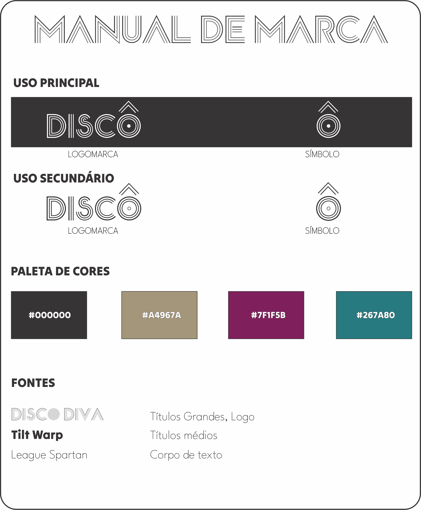
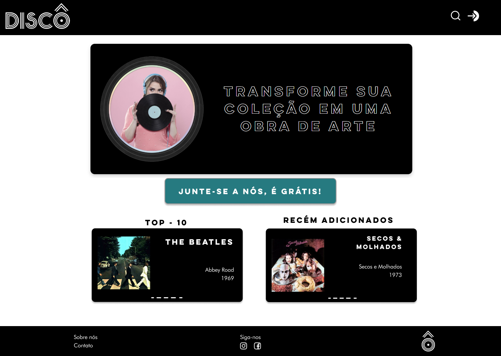

Pré-requisitos: <a href="03-Product-design.md"> Especificação do projeto</a>, <a href="04-Metodologia.md"> Metodologia</a>, <a href="05-Projeto-interface.md"> Projeto de interface</a>

# Template padrão da aplicação
  A identidade visual do site Discô foi projetada para transmitir a essência e os valores da marca, que busca celebrar a música, a arte e a cultura. Cada elemento foi cuidadosamente desenvolvido para criar uma conexão visual forte e consistente com o público-alvo, ao mesmo tempo que se destaca no cenário digital.
  
  A ideia central da identidade visual do Discô é unir nostalgia e modernidade. O nome "Discô" remete à era disco dos anos 70, uma época marcada pela explosão de criatividade na música e na estética. Esse conceito serviu como base para a criação de uma linguagem visual que combina cores marcantes, formas geométricas dinâmicas e um estilo tipográfico marcante.

 

# Página Home para Desktop

##
# Página Home para Celular

